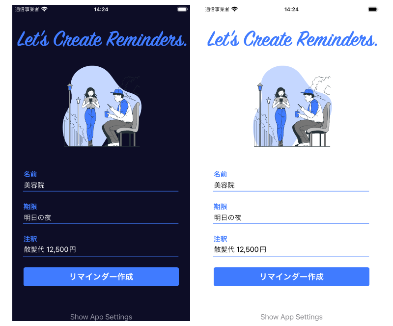

# Reminder Assistant - 簡単かつ効率的なリマインダー管理

## 概要
「Reminder Assistant」は、Appleの純正リマインダーアプリの使い勝手を大幅に向上させるiOSアプリです。忙しい日々の中で、リマインダーを迅速かつ簡単に設定するために最適なツールです。

## 主な機能
- **ロック画面ウィジェットからのアクセス**: 画面をロックした状態からでも、ワンタップでアプリを開くことができます。これにより、リマインダーの追加がより速く、より簡単になります。
- **自動キーボード表示**: アプリを開くと同時にキーボードが表示され、すぐにリマインダーのタイトルを入力できます。手間のかかる操作は一切不要です。
- **直感的な期限設定**: 「明日の夜」のように"あなたの言葉"で期限を設定することができます。面倒なUI操作を省き、テキスト入力だけで次の日の19時などの具体的な時刻にリマインダーをセットすることが可能です。

## ターゲットユーザー
このアプリは、日々のスケジュール管理において効率性と使いやすさを求めるすべてのiOSユーザーに最適です。特に忙しいビジネスパーソンや学生、時間管理を重視する方々には特に役立ちます。

## 使い方の簡単さ
簡潔なインターフェースと直感的な操作性により、どなたでも簡単にリマインダーを設定できます。時間を大切にするあなたのための、シンプルかつパワフルなアシスタントです。

## ダウンロード
「Reminder Assistant」は今すぐApp Storeからダウンロード可能です。あなたの時間管理を、このアプリで革新しましょう。
https://apps.apple.com/jp/app/reminder-assistant/id6444303775?itsct=apps_box_link&itscg=30200